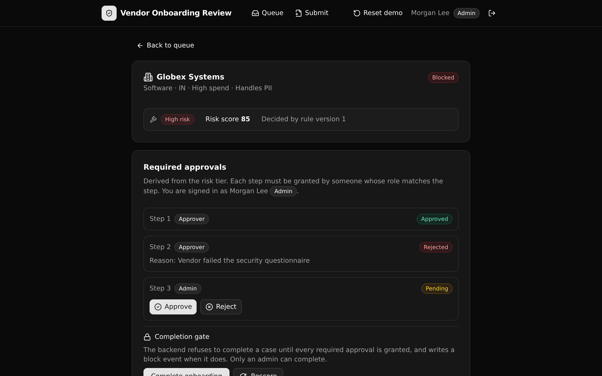

# Vendor Onboarding Review

**A governed procurement backend that makes an AI-built vendor-onboarding tool safe to run in production.** It risk-tiers every vendor from one versioned rule set, derives the approvals that tier requires, and blocks completion at the API layer until each required approval is granted by someone in the right role.



**6 tables · 9 APIs · 1 function.** Xano backend authored in TypeScript with `@xanots/sdk`, plus a React and Vite frontend that derives its paths and types from the backend defs.

## What it demonstrates

This is the governed backend under a plausible AI-generated internal tool, for **Play 3 (Pilot to Production)** in **procurement and vendor risk**. The point is not that an AI can draft an onboarding screen. The point is that the rules a screen depends on live in one readable API layer a technical reviewer can point at and trust:

- **One versioned rule set decides the tier.** A vendor's data access level, spend band, category, and country each add points from the active `risk_rules` version. The score maps to a low, medium, or high tier, and every submission records the exact rule version that decided it.
- **The tier derives the approvals.** Low needs one approver, medium needs two, high needs two approvers plus an admin. The set is generated from the rule outcome, not hand-managed.
- **Completion is gated at the API layer.** A case cannot complete until every required approval is granted. When an admin tries to complete early, the endpoint refuses and writes a `block` event, so the attempt is on the record.
- **Auth is API-layer RBAC.** An auth table backs minted tokens, and every endpoint reads the caller's live role and gates the action with a precondition. A requester cannot approve, and an approver cannot sign an admin step. There is no row-level security here; access is enforced in the API layer.
- **Every state change is audited.** Submit, score, approve, reject, complete, and block each append one row to an append-only trail, naming the actor and the status transition.

An evaluator can open the completion endpoint and see exactly why a high-risk vendor needed an admin sign-off, and why an incomplete case was refused.

## Repo layout

```
xano/
  index.ts                 the workspace, registering everything
  seed-data.ts             the shared demo dataset (deploy seed + reset endpoint)
  tables/                  users, vendors, risk_rules, submissions,
                           required_approvals, approval_events
  functions/score_vendor   the one scoring rule, called by submit and rescore
  api/                     the API group and the nine endpoints
frontend/
  src/lib/api.ts           the one contract: paths and types from the defs
  src/screens/             sign in, submit, queue, case detail
```

## API surface

All endpoints live under the pinned `onboarding` API group.

| Verb | Path | Who | What it enforces |
| --- | --- | --- | --- |
| POST | `/auth/login` | Public | Mint an auth token for a seeded user; the role rides with the token holder. |
| POST | `/submissions` | Requester and up | Create the vendor, score it, derive the approval set, open the case. |
| POST | `/submissions/{id}/rescore` | Admin | Re-evaluate against the active rules; re-derive only the pending steps. |
| GET | `/queue` | Approver and up | The review queue, filterable, with each case's outstanding count. |
| GET | `/submissions/{id}` | Approver and up | The case, its checklist, the deciding rule version, and the audit trail. |
| POST | `/submissions/{id}/approvals/{approval_id}/approve` | Role-matched | Grant one step; the caller's role must match the step. |
| POST | `/submissions/{id}/approvals/{approval_id}/reject` | Role-matched | Reject a step with a reason and block the case. |
| POST | `/submissions/{id}/complete` | Admin | Refuse (and log a block) until every approval is granted. |
| POST | `/seed` | Public | Reset the workspace to the demo dataset. |

## Quick start

Clone it, deploy it, and you have a live governed backend in about a minute.

```bash
git clone https://github.com/xano-scratch/vendor-onboarding-review.git
cd vendor-onboarding-review
npm install
npx xanots login          # one-time browser auth with your Xano account
npm run xano:deploy       # deploys the backend and frontend, self-seeds, prints the live URL
```

The deploy ships seed data, so the queue and a case detail are browsable right away. Sign in with one of the demo accounts (all use the password `Passw0rd!23`):

| Email | Role |
| --- | --- |
| `riley@northwind-holdings.test` | requester |
| `avery@northwind-holdings.test` | approver |
| `morgan@northwind-holdings.test` | admin |

Local development runs the frontend against a deployed backend:

```bash
echo "VITE_XANO_HOST=<your deployed backend url>" > .env.local
npm run dev
```

## How the score works

The `score_vendor` function reads the active `risk_rules` rows that match a vendor's attributes and sums their points. The seeded rule set (version 1) scores like this:

- Data access: none 0, internal 20, handles PII 50
- Annual spend: low 0, mid 10, high 20
- Category: services 0, hardware 0, software 5, data processor 15
- Country: a small per-country adjustment

Thresholds map the total to a tier (high at 60, medium at 30). These numbers are illustrative, so a real team would tune them, and because they live in a table, a new version is a data change rather than a code change.

## FAQ

**Is the risk scoring real business logic?** Yes. It runs against a versioned table of rules, and both submit and rescore call the same function, so the rule that decides a tier lives in exactly one place.

**How is access controlled?** With API-layer role checks. Each endpoint reads the caller's current role from the auth table and gates the action. Roles are enforced in the API, not with row-level security.

**Are the live links permanent?** No. The deploy targets a short-lived Xano environment for review. The durable artifact is this repo; run `npm run xano:deploy` for fresh links.

**Is this a production system?** No. It is a proof artifact that shows a governed backend pattern. It runs entirely on seed data with no external credentials.

## License

MIT. See [LICENSE](LICENSE).
