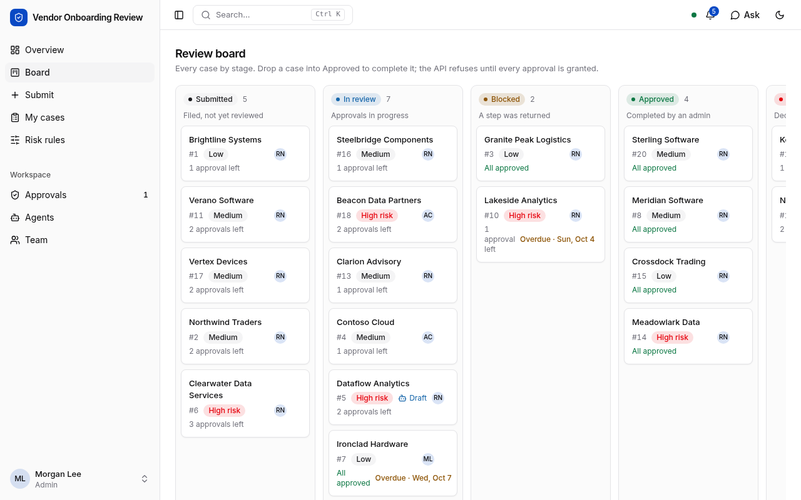

# Vendor Onboarding Review

A governed procurement backend that risk-tiers each vendor from one versioned rule set, derives the approvals that tier needs, and blocks completion at the API layer until every required approval is granted by the right role.

**Enterprise · Play 3 (Pilot to Production) · Procurement**

`5 tables · 13 endpoints · 6 screens · auth: @xano-sdk/auth`



This is the governed backend under a plausible AI-built vendor-onboarding tool, made safe to run in production. The business rules live in one readable API layer. A reviewer can open the completion endpoint and see exactly why a high-risk vendor needed an admin sign-off, and why an incomplete case was refused.

## Quick start

```sh
git clone https://github.com/xano-scratch/vendor-onboarding-review
cd vendor-onboarding-review
npm install
```

Then run it one of two ways:

- **On your machine, no account.** `npm run xano:deploy` deploys and seeds the backend on the Xano Engine on your machine, then `npm run dev` opens the app. Click **Continue as Morgan** on the sign-in screen.
- **On a cloud link** (works with ChatGPT and Claude connectors). `npx xanosdk login` once, then `npm run xano:deploy:ephemeral` prints a live URL.

The demo signs you in with one click, as one of three people:

| Persona | Role | What they do |
|---|---|---|
| **Morgan Lee** | admin | Completes cases (the final gate), rescores, publishes the rule set, manages the team |
| **Avery Chen** | approver | Works the queue and clears the review steps that match their role |
| **Riley Novak** | requester | Files vendors and tracks their own cases |

## What you can do

**As Morgan (admin), the first run:**

1. Open the **Review board**. Cases sit in columns by stage, with the risk tier on each card and a count of the approvals still outstanding. One case shows a small **Draft** mark: an agent teed up an action that is waiting for you.
2. Open the high-risk **Dataflow Analytics** case. It needed three approvals (two approvers and one admin), and the case names the rule version that decided it. Press **Complete**. The API refuses it, because a required approval is still pending, and a `block` line is written to the audit trail. That is the gate, made visible.
3. Open a **second window** and continue as **Avery (approver)**. Approve the pending approver step. Watch it arrive in Morgan's board and case view with no reload.
4. Back as Morgan, approve the remaining admin step, then press **Complete**. The case moves to **Approved**, and the trail shows the full submit, approve, complete sequence.
5. Switch to **Riley (requester)**. You see only **My submissions**, with no Approve or Complete. The role difference is enforced by the API, not hidden in the screen.

**Submitting a vendor:** open **Submit a vendor**, fill in the vendor's category, country, spend band and data access, and file it. The app scores it against the active rules, shows the tier and the deciding rule version, and lists the approval checklist that tier generated. A data processor that handles PII at high spend lands in the high tier and needs an admin sign-off. A low-risk service needs one approver.

## Connect your agent

The app ships a permissioned MCP server, so an agent can work the queue under the same rules a person does.

1. Sign in, open **Agents**, and pick your agent.
2. **Coding agents** (Claude Code, Cursor, VS Code, Codex, Windsurf): create a key, then run the one command or click the one link the page shows. The key is shown once and never stored.
3. **ChatGPT and Claude** (web and desktop): add the sign-in URL as a connector and sign in with your own account. Demo personas have no password, so sign up for an account first.

The tools it gets:

| Tool | Read or write | What it does | Asks you first? |
|---|---|---|---|
| `list_review_queue` | read | Lists cases awaiting review, filtered by tier or status. A requester sees only their own. | no |
| `get_case` | read | One case: its checklist, deciding rule version, and audit trail. | no |
| `score_preview` | read | Given vendor attributes, returns the tier and the approvals it would need. | no |
| `submit_vendor` | write | Files a vendor on your behalf (the person's own routine intake). | no |
| `approve_step` | write | Drafts approving a review step, for you to confirm. | **yes** |
| `complete_case` | write | Drafts completing a case, for an admin to confirm. | **yes** |

Your agent can draft approving a step or completing a case, but a person approves it first, under **Approvals**. Completion is still refused there until every required approval is granted. Revoke a key or sign an agent out on the **Agents** page, where you can also see every call it made.

For a self-hosted copy, set `MCP_OAUTH_LOGIN_URL` after the first cloud deploy (see "Going to production"), or sign-in clients cannot connect.

## Built in

Every screen already does the things people expect from an app made today:

- **Live updates.** When a person, their agent, or the assistant changes a case, every open board and case view updates with no reload. The board and the case detail show who else is looking.
- **Notifications.** On submit, the approvers are told. On a decision, the submitter is told. The bell carries the unread count.
- **Command palette.** Press ⌘K to jump to any screen, or to a case by vendor name or id.
- **The assistant.** Open it from the header's **Ask**. It answers from the app's data: summarise the queue, say why a case is blocked, or explain a risk score. It can draft a case completion for an admin to approve.
- **Invites and resets.** An admin invites a teammate by email and role from **Team**, as a one-time link. Password resets work the same way. No mail service is needed.
- **Settings.** The workspace name, time zone and week start, plus one domain setting: the review SLA in days, which flags a case overdue on the board.

## How auth works

The template starts from [`@xano-sdk/auth`](https://github.com/xano-sdk/auth), ejected into owned source, so the user table, roles, and demo sign-in are the app's to edit.

| Role | Can | Cannot |
|---|---|---|
| `requester` | File vendors, see and track their own cases | See the full queue, approve any step, complete a case, manage rules |
| `approver` | Work the queue, clear the steps that match their role, read any case | Act on an admin step, complete a case, manage rules or the team |
| `admin` | Everything: act on admin steps, complete a case, rescore, publish a rule version, manage the team | |

Permissions live in one map ([`@xano-sdk/rbac`](https://github.com/xano-sdk/rbac), `xano/rbac.ts`). Every endpoint guard, agent tool, assistant tool, approver list and screen reads that one map. Guards are at the API layer (`guard.role`, `guard.owner`, `guard.require`), not row-level security: identity comes from the signed-in token (`auth("id")`), never from the request. A requester who asks for the full queue gets a 403. A requester who asks for a case that is not theirs gets a 404.

Admins change roles under **Team**, and every change is recorded. The demo users share one deliberately public password, used only to seed the accounts; the demo buttons sign in without it. To turn the demo off, delete the `demo_persona` rows and the demo users. Tokens last 24 hours by default.

## API surface

All domain endpoints are under `api:onboarding/*` and need a signed-in token.

| Verb | Path | Who may call it | What it enforces |
|---|---|---|---|
| GET | `/overview` | signed in | Counts, scoped to the caller's role |
| GET | `/queue` | approver, admin | The review queue with each case's outstanding count |
| GET | `/submissions/mine` | signed in | The caller's own cases only |
| GET | `/submissions/{id}` | owner, or approver and admin | One case, its checklist and trail; 404 if not yours and you can't read all |
| GET | `/vendors` | signed in | Vendors with their latest tier and status |
| GET | `/rules` | approver, admin | The active rule set and the review SLA |
| POST | `/submissions` | requester, approver, admin | Scores the vendor, derives the tier's approvals, writes a submit event |
| POST | `/submissions/{id}/approvals/{approval_id}/approve` | approver or admin whose role matches the step | Advances the case, writes an approve event |
| POST | `/submissions/{id}/approvals/{approval_id}/reject` | approver or admin whose role matches the step | Blocks the case with a reason, writes reject and block events |
| POST | `/submissions/{id}/complete` | admin | The gate: refuses with a block event until every approval is granted |
| POST | `/submissions/{id}/rescore` | admin | Recomputes the tier, re-derives the pending steps |
| POST | `/rules/activate` | admin | Publishes a new rule version, retires the prior one |
| PATCH | `/settings` | admin | Sets the review SLA in days |

## Repo layout

The app's own files:

- `xano/app.ts` (roles and demo people), `xano/rbac.ts` (the permission map), `xano/approvals.ts` (the approval actions).
- `xano/domain.ts` lists everything of the app's own. The tables are in `xano/table/`, the scoring rule in `xano/function/score_vendor.ts`, the shared actions in `xano/function/case_actions.ts`, and the endpoints and tools in `xano/query/onboarding/`.
- `frontend/src/app.config.tsx` (screens, nav, ⌘K, the assistant), `frontend/src/lib/` (the typed API contract), and `frontend/src/pages/` (the screens).

The base app, shared by every template in this family, is in `xano/base/`, `frontend/src/base/`, and `frontend/src/components/kit/`. It covers sign-in, the shell, notifications, live updates, activity, settings, profile, team, agents, approvals and the assistant.

## Extend it

- **Add a rule attribute.** Add a value to `risk_rules` and a matching branch in `score_vendor` (`xano/function/score_vendor.ts`), then show it on the Risk rules screen.
- **Add a fourth approval tier.** Change how `submit` derives `required_approvals` by tier (`xano/query/onboarding/writes.ts`), and the board picks it up.
- **Add a reviewer SLA report.** Add a GET endpoint that counts overdue cases by tier, and a stat card on the overview that links to it.

## Going to production

- Remove the demo personas: delete the `demo_persona` rows and the demo users, and the shared demo password with them.
- Set a real token expiry on the auth group.
- After the first cloud deploy, set the sign-in URL so ChatGPT and Claude can connect: `npx xanosdk env set MCP_OAUTH_LOGIN_URL "<backend-url>/api:mcp-oauth-vendor-onboarding-review/mcp_oauth/login"`.
- Cut a release and promote it: `npx xanosdk release create <name>`, then `npx xanosdk promote <name>`.

## What it demonstrates

**Play 3, Pilot to Production, for procurement.** An AI-built vendor-onboarding tool is quick to stand up and risky to trust. This is the backend that makes it safe to run: the business logic lives in one governed API layer, access is checked per endpoint by role (API-layer RBAC, not row-level security), and every state change is written to an append-only audit trail. The rule that decides a vendor's risk tier lives in exactly one place, and it is versioned, so the version that decided each past case is on the record.

The point an evaluator can check in a minute: a high-risk vendor generates more approvals than a low-risk one, including an admin step; completion is refused at the API layer while any approval is pending; and a wrong-role action is refused by the endpoint, not by a hidden button.

## FAQ

- **Does it need any external service?** No. It runs on seeded data the moment it deploys, with no credentials.
- **Is the risk scoring real?** The thresholds are illustrative (under 20 low, 20 to 59 medium, 60 or more high). A real team would tune the rules on the Risk rules screen. The mechanism, one versioned rule set that derives the required approvals, is the point.
- **Can an agent complete a case on its own?** No. An agent can draft a completion, but an admin approves it, and the gate still refuses an incomplete case even then.
- **Where is the audit trail?** On each case, under the determination. It records every submit, score, approve, reject, complete and block, with the actor and the status it moved from and to.
